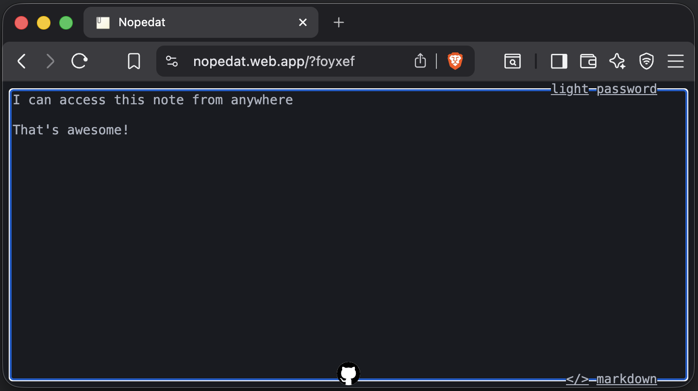

# Lamartine Cabral

This repository contains the source for my personal landing page, hosted on GitHub Pages at [lamartinecabral.github.io](https://lamartinecabral.github.io).

The site is designed to present who I am, what I care about, and the kind of work I like building. It highlights my passion for programming, artificial intelligence, and solving real problems with practical software.

The visual direction is intentionally minimalist, with a clean layout and monospace typography that matches the technical tone of the portfolio.

## Featured projects

### Minicode

Minicode is a lightweight AI agent CLI powered by Ollama, built for terminal-first workflows and local experimentation with AI.

### Nopedat

Nopedat is a lightweight web note app focused on simple note sharing, markdown-friendly writing, and quick access from anywhere.

## Links

- Live site: [lamartinecabral.github.io](https://lamartinecabral.github.io)
- LinkedIn: [linkedin.com/in/lamartine-cabral](https://www.linkedin.com/in/lamartine-cabral/)
